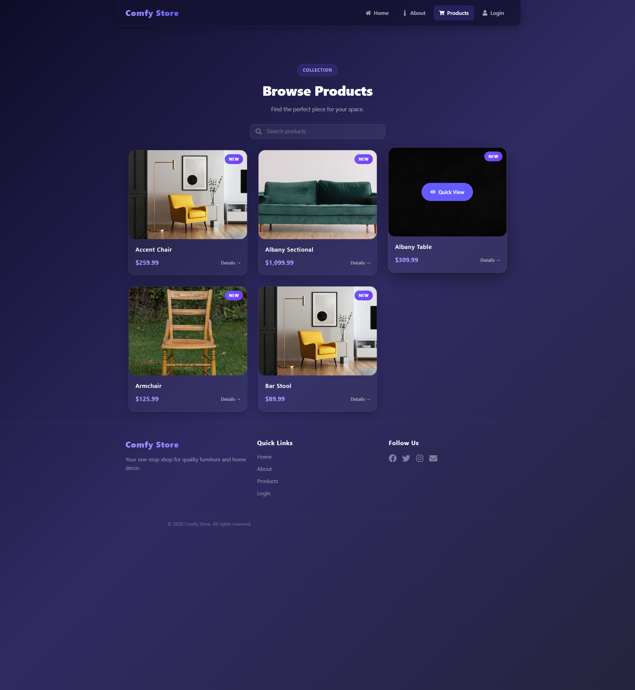
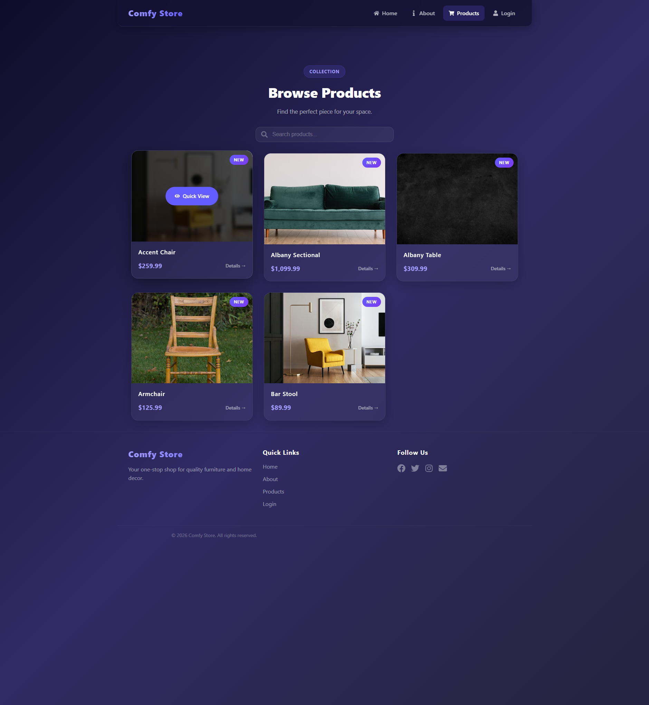
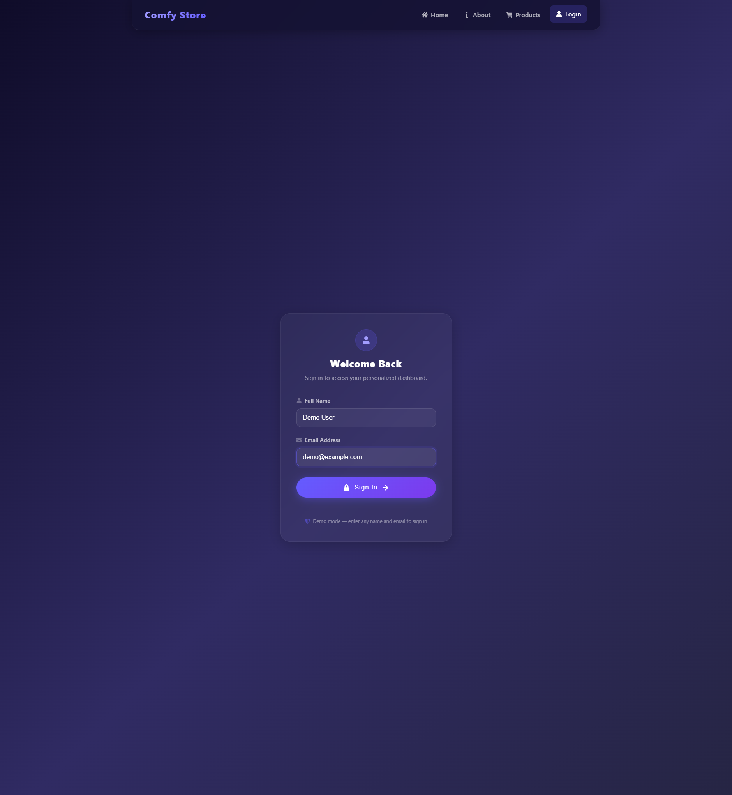
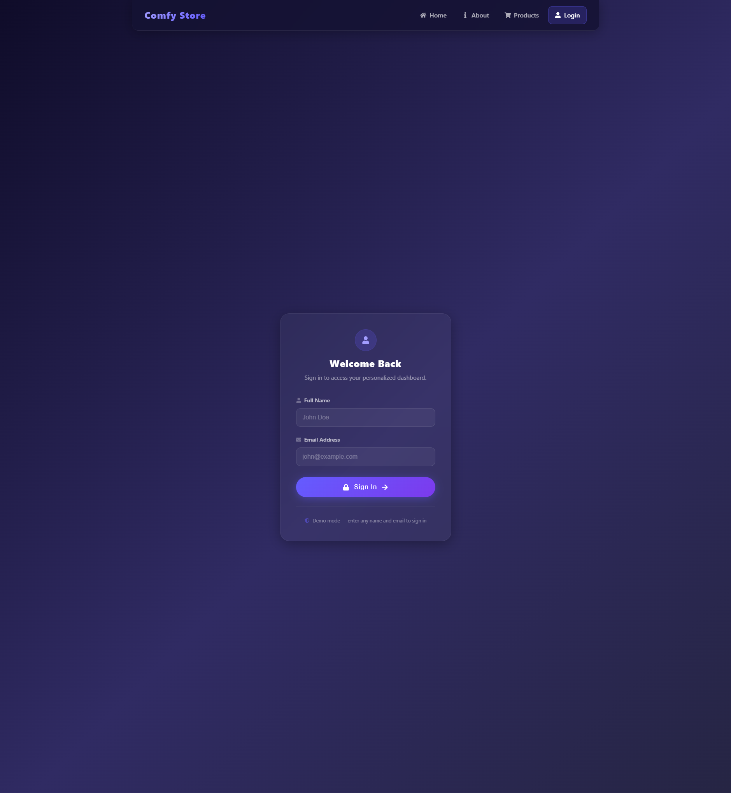
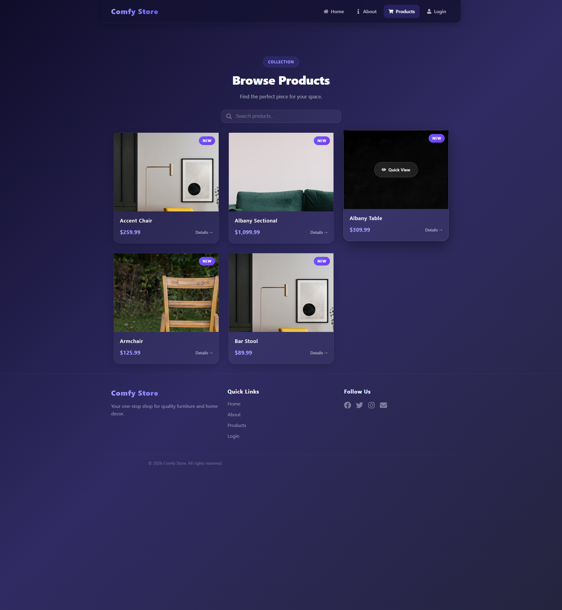
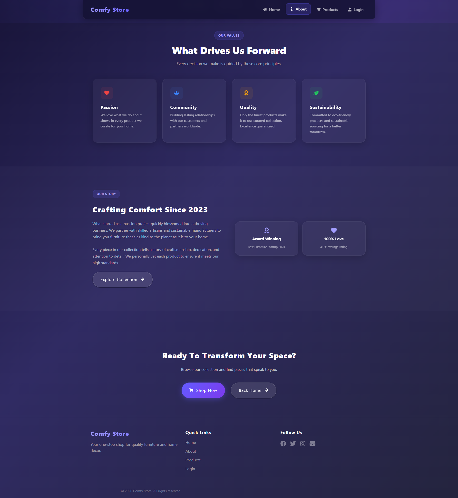
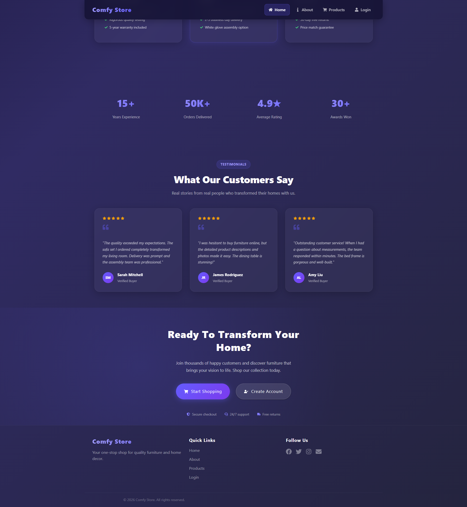

# FurniStyle 🛋️

A modern, responsive furniture e-commerce application built with **React 19** and **React Router DOM 7**, featuring a stunning glassmorphism design system, smooth animations, and a fully responsive layout.

## 📸 Screenshots

| | | |
|:---:|:---:|:---:|
|  |  |  |
|  |  |  |



---

## ✨ Features

| Feature | Description |
|---------|-------------|
| 🎨 **Glassmorphism Design** | Modern UI with glass-effect cards, blur backdrops, and gradient accents |
| 🧭 **React Router 7** | Nested layouts, dynamic routes, protected routes, and error boundaries |
| 🔍 **Product Search** | Real-time filtering with a clean search interface |
| 🖼️ **Image Gallery** | Interactive product detail view with thumbnail navigation |
| 📱 **Fully Responsive** | Optimized breakpoints for mobile, tablet, and desktop |
| 🏠 **Hero Animations** | Floating background shapes with smooth parallax-like motion |
| 🛡️ **Protected Routes** | Authentication flow with login and user dashboard |
| 🔄 **Smooth Hover States** | Cards lift, images reveal overlays, and borders animate |
| ♿ **Accessibility** | Focus-visible indicators and reduced-motion support |

## 🛠️ Tech Stack

| Technology | Version |
|------------|---------|
| [React](https://react.dev/) | 19.2.x |
| [React Router DOM](https://reactrouter.com/) | 7.17.x |
| [Vite](https://vitejs.dev/) | 8.x |
| [TypeScript](https://www.typescriptlang.org/) | 6.x |
| [React Icons](https://react-icons.github.io/react-icons/) | 5.6.x |
| [ESLint](https://eslint.org/) | 10.x |

## 🚀 Getting Started

### Prerequisites

- **Node.js** v18 or higher
- **npm**, **yarn**, or **pnpm**

### Installation

```bash
# Clone the repository
git clone <repository-url>
cd furnistyle

# Install dependencies
npm install

# Start the development server
npm run dev
```

Open [http://localhost:5173](http://localhost:5173) in your browser.

### Build for Production

```bash
npm run build
npm run preview   # Preview the production build locally
```

### Lint

```bash
npm run lint
```

## 📁 Project Structure

```
src/
├── components/
│   ├── Pages/
│   │   ├── About.tsx              # About us page with story & values
│   │   ├── Dashboard.tsx          # User dashboard (protected)
│   │   ├── Error.tsx              # 404 / error page
│   │   ├── Home.tsx               # Landing page with hero & features
│   │   ├── Login.tsx              # Login / authentication page
│   │   ├── Products.tsx           # Product catalog with search
│   │   ├── ProtectedRoute.tsx     # Auth guard wrapper
│   │   ├── SharedLayout.tsx       # Main layout (nav + footer)
│   │   ├── SharedProductLayout.tsx# Product sub-layout
│   │   └── SingleProduct.tsx      # Product detail view
│   ├── sections/
│   │   ├── AboutHeroSection.tsx   # About page hero
│   │   ├── AboutCallToAction.tsx  # About page CTA
│   │   ├── StorySection.tsx       # About page story
│   │   └── ValuesSection.tsx      # About page values
│   ├── StyledNavbar.tsx           # Responsive navigation bar
│   ├── Footer.tsx                 # Site footer
│   └── usePages.tsx               # Navigation pages configuration
├── data/
│   └── index.ts                   # Product data / mock data
├── types/
│   └── index.ts                   # TypeScript type definitions
├── App.tsx                        # Root component with routes
├── main.tsx                       # Application entry point
├── index.css                      # Global styles & design system
└── vite-env.d.ts                  # Vite type declarations
```

## 🗺️ Routes Overview

| Route | Page | Access |
|-------|------|--------|
| `/` | Home | Public |
| `/about` | About | Public |
| `/products` | Product Catalog | Public |
| `/products/:id` | Product Detail | Public |
| `/login` | Login | Public |
| `/dashboard` | Dashboard | 🔒 Protected |
| `*` | 404 Error | Public |

### Route Architecture

- **SharedLayout** wraps all routes with the navbar and footer
- **SharedProductLayout** wraps `/products/*` with a breadcrumb-style back link
- **ProtectedRoute** wraps `/dashboard` and redirects unauthenticated users to `/login`

## 🎨 Design System

### Color Palette

```
Primary:   #645cff → #504acc (purple gradient)
Grey:      #f8fafc → #0f172a (50–900 scale)
Success:   #22c55e / #16a34a
Error:     #ef4444 / #dc2626
Warning:   #f59e0b
```

### Glassmorphism Tokens

```css
--glass-bg:        rgba(255, 255, 255, 0.04);
--glass-border:    rgba(255, 255, 255, 0.06);
--glass-blur:      blur(12px);
--glass-shadow:    rgba(0, 0, 0, 0.2);
```

### Typography

- **Font Stack**: System font stack (`-apple-system, BlinkMacSystemFont, "Segoe UI", Roboto, ...`)
- **Scale**: Responsive `clamp()` values for headings
- **Heading Sizes**: `3.052rem` (h1) → `1.25rem` (h5)

### Shadow System

4 depth levels (`--shadow-1` through `--shadow-4`) for creating visual hierarchy.

## 🖥️ Key Components

### Navigation
- **StyledNavbar** — Sticky glass-effect navbar with mobile hamburger menu, active link indicators, and keyboard focus styles
- **Footer** — Multi-column footer with social links

### Home Page
- **Hero Section** — Full-viewport hero with animated floating shapes, gradient text, stats bar, and CTA buttons
- **Features Grid** — Glass cards with animated top-border hover effect
- **Stats Banner** — 4-column statistics display
- **Testimonials** — Customer review cards with star ratings
- **CTA Section** — Call-to-action with trust indicators

### Product Pages
- **Products** — Responsive grid of product cards with image overlay zoom, real-time search, and "new" badges
- **SingleProduct** — Two-column layout with sticky image gallery, color swatches, quantity selector, specs grid, and related products

### About Page
- **AboutHero** — Stats-driven hero section
- **ValuesSection** — Value cards with dynamic accent colors
- **StorySection** — Two-column story grid with milestone cards
- **AboutCallToAction** — Final CTA with buttons

### Authentication
- **Login** — Glassmorphism login card with demo credentials hint
- **Dashboard** — User dashboard with welcome card, stats grid, and action cards

## 📱 Responsive Breakpoints

| Breakpoint | Target |
|------------|--------|
| `< 768px` | Mobile |
| `768px – 1024px` | Tablet |
| `> 1024px` | Desktop |

### Mobile Optimizations
- Navbar collapses to hamburger menu
- Product cards stack in single column
- Single product page switches to single-column layout
- Gallery becomes non-sticky with horizontal scrollable thumbnails
- Dashboard stats and action cards stack vertically

## ♿ Accessibility

- `:focus-visible` outlines on interactive elements
- `prefers-reduced-motion` disables animations
- Semantic HTML structure
- Proper button and link ARIA roles

## 🔧 Available Scripts

| Script | Description |
|--------|-------------|
| `npm run dev` | Start Vite development server |
| `npm run build` | TypeScript compile + Vite production build |
| `npm run preview` | Preview the production build |
| `npm run lint` | Run ESLint on all source files |

## 🙏 Acknowledgments

- [React Router](https://reactrouter.com/) — Powerful routing for React
- [Vite](https://vitejs.dev/) — Lightning-fast build tooling
- [React Icons](https://react-icons.github.io/react-icons/) — Icon library
- [Unsplash](https://unsplash.com/) — High-quality product images

---

**Built with ❤️ using React 19 + React Router 7**
